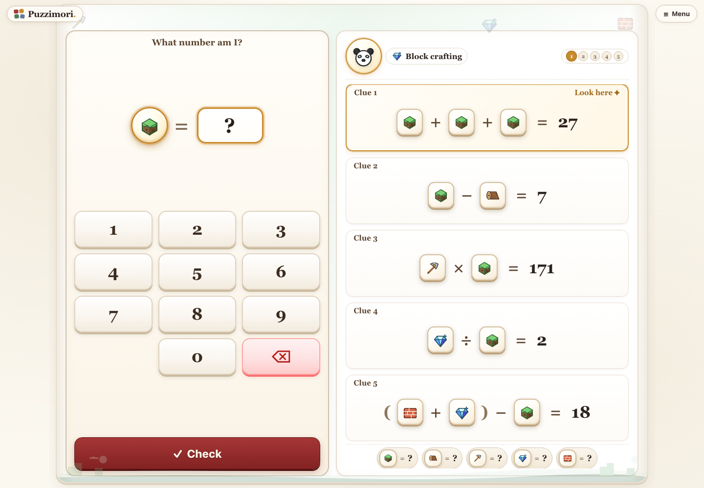

# Puzzimori

**Little puzzles. Big discoveries.**

A diamond, a cupcake, a dragon—each picture hides a number. Follow the clues and uncover them one at a time in Puzzimori, a playful math adventure for curious children and the grown-ups exploring alongside them.



## A little adventure in every puzzle

- **Ten illustrated worlds.** Explore a crafting world, a kitchen, a sushi bar, a kingdom, a Viking voyage, a garage, a garden, a game room, a forest, and a farm.
- **Ten levels of challenge.** Begin with small-number addition, then explore subtraction, multiplication, and exact division. Choose the pace that feels right.
- **Fresh puzzles to discover.** Generated puzzles offer new combinations of hidden numbers, with a unique solution for every clue.
- **English and Hebrew.** Switch languages from Menu, with layouts that follow the reading direction and equations that stay easy to read.
- **Feedback along the way.** Check an answer, try again, and celebrate each discovery with an animated companion and a burst of confetti when the puzzle is complete.
- **Straight into play.** No accounts, profiles, or name forms. One game and its progress are saved in your browser.

## Choose, follow, discover

1. **Choose a world.** Start playing immediately, or tap the Puzzimori logo to explore the illustrated world gallery.
2. **Follow the clues.** Each clue introduces one new hidden number. Use the numbers you have already found to work out the next one.
3. **Make a discovery.** Enter your answer with the on-screen keypad or a keyboard. Complete the puzzle, celebrate, and try another!

The current clue sits beside the keypad while the full clue board and discovered numbers stay visible. There is room to think, retry, and take the next step.

## Built for small discoveries

Puzzimori offers a playful way to practice arithmetic and reason about unknown numbers. Every puzzle can be solved in order, one picture at a time; hidden values appear only after a correct answer.

Children choose their own challenge in Menu. After three consecutive completions with at most one hint per puzzle, the game suggests trying a harder level—it leaves the choice to the player. Replacing a puzzle after attempts or hints asks for confirmation, so a change of mind can keep the current adventure intact.

Play on a phone or desktop, use the keypad or physical digit keys, and turn animations on or off in Menu. The game also respects reduced-motion preferences.

### Pick up where you left off

An unfinished puzzle, language choice, difficulty, and completion statistics stay in the current browser. Animation preferences are saved too. No account, analytics, database, or AI service is required.

Progress belongs to one browser and site address. It does not sync across devices or transfer from localhost to a deployed site. Clearing browser data removes it. If saving is blocked, you can still play, but that visit's progress will not be saved.

## Run locally

Built with Next.js, React, TypeScript, and CSS Modules. Use **Node.js 24** (see `.nvmrc`) and **pnpm 11.21.0**.

```sh
corepack enable
pnpm install --frozen-lockfile
pnpm dev
```

Open <http://localhost:3000> and start discovering.

## Difficulty guide

| Level | Symbols | Values | Operations                           | Maximum equation total |
| ----- | ------- | ------ | ------------------------------------ | ---------------------- |
| 1     | 2       | 1–5    | Addition                             | 30                     |
| 2     | 3       | 1–8    | Addition                             | 30                     |
| 3     | 4       | 1–10   | Addition                             | 30                     |
| 4     | 4       | 1–10   | Addition, subtraction                | 50                     |
| 5     | 4       | 1–12   | Addition, subtraction                | 50                     |
| 6     | 4       | 1–12   | Add multiplication, factors up to 5  | 100                    |
| 7     | 4       | 1–12   | Multiplication factors up to 10      | 100                    |
| 8     | 4       | 1–12   | Add exact division, divisors up to 5 | 100                    |
| 9     | 4       | 1–12   | Division divisors up to 10           | 100                    |
| 10    | 5       | 1–20   | All four operations                  | 200                    |

Subtraction is nonnegative and division has integer intermediate results. Each operation enabled at a level appears in every generated puzzle. Generated puzzles assign a distinct value to each emoji.

## Architecture

- `src/engine`: typed expression trees, seeded generation, difficulty constraints, independent validation, and semantic hints. No React, Next.js, storage, or translation imports.
- `src/game`: pure reducers for attempts, hints, language preferences, and completion statistics.
- `src/storage`: a versioned localStorage adapter that regenerates and checks persisted puzzle metadata before accepting a saved game. Invalid saved games are rejected; unavailable storage falls back to memory. Existing selected-profile progress migrates to a single game save without names, avatars, or player IDs.
- `src/i18n`: complete English/Hebrew messages, emoji labels, operation names, and hint strategies.
- `src/components`: responsive screens and scoped styles. `src/app` supplies the server-rendered application shell and metadata.

The generator accepts `{ seed, theme, difficulty, engineVersion }`. Reusing these options yields the same puzzle. Version 2 assigns a unique value to every emoji. Unfinished version 1 games restart as fresh version 2 puzzles while completed progress and settings carry over. Up to 32 generation attempts are checked for correctness before a validated constructive fallback. Preserve each engine version's behavior when changing code; a new generation algorithm must receive a new persistence version or explicit migration.

The language switch sets page language and direction while mathematical expressions remain LTR. Native dialogs protect in-progress puzzles, restore focus, and support Escape. Reduced motion is respected. Keyboard answers, a number pad, emoji labels, and live feedback are included.

## Verification

```sh
pnpm exec playwright install chromium
pnpm verify
```

`pnpm verify` runs Repnix health checks, dependency auditing, the production build, and browser tests. Health checks cover types, lint, formatting, unit tests, accessibility rules, dead code, and architecture boundaries.

Tests cover 1,000 seeds at each of ten levels, unique solutions, sequential solvability, hint boundaries, game transitions, saved-puzzle validation, legacy-save migration, and translation completeness. Browser tests exercise desktop/mobile play, English/Hebrew layouts, keyboard and keypad input, puzzle replacement, storage failures, reload/resume, animation preferences, and progression suggestions. GitHub Actions runs the same verification.

For focused checks:

```sh
pnpm health
pnpm test:run
pnpm build
pnpm test:e2e
```

## Deploy to Vercel

No environment variables are needed.

1. Push the project to your Git provider.
2. Import it into Vercel using the **Next.js** framework preset and repository root directory.
3. Set installation to `pnpm install --frozen-lockfile`, the build to `pnpm build`, and Node.js to version 24.
4. Deploy, then configure the site address in the project's Domains settings.
